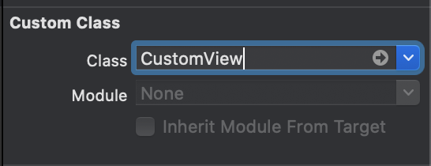

경기도 지역 화폐 가맹점 지도
===================

>이 프로젝트는 재난 지원금 으로 인해 지역화폐가 이슈가 되어서 지역화폐 찾는 지도 하나쯤 있으면 좋겠다 싶어서 만듬

</br>

이번 글에서는 경기도 지역화폐 가맹점 지도 앱을 만들것이다. 지도의 중심을 기준으로 주변의 가맹점들이 검색되어 지도에 핀으로 찍히고, 상호명으로 검색이되는 앱을 만들 생각이다. 이런 앱을 만드는 과정 속에서 습득했고 또 알고있던 기본개념들을 정리해보았으며, 기술적으로 레벨업시키기 위해 노력했던 과정을 공유해보고자 한다. 

프로젝트에 대해서 궁금한 점이 있거나 부족한 점이 보인다면 이슈 탭에 코멘트 언제든지 환영. 

</br>

목차
-----
[1. 준비](#준비)  

+ 개발 준비 단계. 프로젝트에 대한 추상화 그리고 구체화 방법 모색

[2. 개발](#개발)

+ 실제 개발 단계.  나의 개발 습관들과 프로젝트에 사용된 기술들에 대해서 엿볼 수 있다.

[3. 발생한 문제와 해결](#발생한-문제와-해결)

+ 개발 단계에서 생기는 문제점들과 이들을 해결한 경험. 

[4. 프로젝트 레벨업](#프로젝트-레벨업) 

+ 기술적으로 이 프로젝트를 발전시키기 위한 방안과 노력. 

</br>
</br>

준비
-----
_개발환경_
> + Platform: iOS 
> + Language: Swift 5
> + Library: Alamofire  + RX Swift (v.2) + Realm (v.3)   

</br>

나는 객체 지향 방법론으로 이 프로젝트에 접근하여 개발하기 시작했다. 때문에 객체 지향에 대한 나 나름대로의 설명과 함께 이 프로젝트에 대한 기록을 설명할것.

객체 지향 방법론이란 프로젝트를 접근하는 방법 중 하나인데,  하고자 하는 프로젝트에서  대상화 할 수 있는 개념들을 위주로 생각하는 방법을 말한다. 즉, 어떤 대상들을 만들어서 이를 어떻게 엮어서 개발할것인가하는 방법이다. 또 이 방법론 중에서도 MVC디자인 패턴을 사용하였다.  

개발 파트에서는 이러한 접근법에 따른 얘기들과 또 실제 어떻게 개발했는지, 실제 개발하면서 어떤 어려움을 겪었으며 프로젝트를 업그래이드 시키기 위해서 어떤 노력을 했는지를 써보려고한다.

</br>

### 1.1. 프로젝트 추상화

프로젝트 추상화는 내가 만들 이 프로젝트를 머리속으로 시뮬레이션을 하면서 어떤 구성요소들로 이루어지는지 생각해보는 단계다.  

나는 프로젝트에 처음 접근 할 때 가장 중요한 구성요소들을 생각하여 이 프로젝트를 추상화 한다.
추상화 할 때 나는 내가 만들고자 하는 앱을 상상속에서 사용한다고 혹은 그 상황을 겪는 다고 상상하면서 그 상황이 성립하기 위해 핵심적인 필요한 요소들과 그 상황속에서 요소들이 사용되면서 일어나는 상호작용을 생각한다. 

생각을 잘못하면 이 프로젝트의 방향을 아주 잘못 잡아버리는 것이기 때문에 아주..! 신중하게 생각해야한다. (하지만 어렵다.. 잘못잡아서 개고생한적도 여러번.. 고로 신중히 또 신중히 하자.)

그럼 이제 신중하게 이 프로젝트에 필요한 중요 구성 요소들을 고민해보고 이들을 어떤 상호작용이 일어나는지를 고민해보자. 

</br>

### 1.1.1. 중요 객체

우리가 지도를 이용해 지역화폐 가맹점들을 찾는 상황을 생각해보자.
우리가 전지적 작가 시점에서 앱을 사용하는 상황을 본다고 생각 했을 때 어떤 것이 보일까?  
.  
.  
.  
.  
.  
지도 그리고 지도를 찾는 나 마지막으로 가맹점 즉 가게가 보일 것이다.

그럼 우리가 이 프로젝트를 만들기 위해서 만들 구성 요소는 크게 사용자, 지도, 가게일 것이다. (이 프로젝트에서 개인 별로 특화 되어 제공되는 데이터는 없기 때문에, 예를 들어 즐겨찾기 같은, 사용자객체는 매우 작을것.) 우리는 이런 개념지을 수 있는 구성요소들을 객체라고 한다. 이렇게 고민해서 만들어지는 프로젝트에 필요한  객체들을 Model이라고 한다.

그럼 우리는 이제 이 세개의 객체를 만드는데 우리가 원하는 행동을 위해 각각의 객체가 서로 상호작용하도록 만들면 개발 끝이다! 
개발 참 쉽다. (거짓)

```
* 중요한 3가지 객체 *
1. 지도
2. 가게
3. 사용자
```

</br>

### 1.1.2. 행동(상호작용)

그럼 이제 내가만들고자 하는 프로젝트에서 모델끼리 어떤 상호작용을 할지 하나하나 차근 차근 상상해보자. 

1. 지도-가게

```
1. 지도 위에는 가맹점인 가게 위치가 보여져야한다.
2. 지도 위의 가게를 클릭하면 가게에 대한 정보가 보여져야한다. 
```

지도-가게 상호작용을 본다면 지도 객체는 가게의 위치와 세세한 정보를 가지고 있는 객체가 필요해 보인다.
이말인 즉슨 가게 객체는 각각 가게의 위치와 세세한 정보를 포함하고 있어야한다는 얘기. 
나는 가게 객체로 부터 가게 정보를 받아와서 이 지도에 보여주면 된다. 

</br>

2. 지도-사용자
```
1. 사용자위치를 중심으로 지도를 보여준다.
```
지도-사용자의 상호 작용을 본다면 지도는 사용자의 위치를 중심으로 줌 레벨에 따라 지도의 일부분이 보여져야한다. 그런데 지도와 사용자만으로는 지도의 일부분이 보여진다는 것을 설명하기엔 좀 어색하다. 사용자 객체의 의의 사용자에 대한 정보를 담는 것인데 위치 정보는 그렇다 쳐도 줌 레벨은 뭔가 사용자가 가지기에는 어색한 정보라는 느낌이 있다.  이럴때는 새로운 객체가 필요하다는 뜻이거나 중요 객체를 잘못잡았다는 뜻이다.

여기서는 카메라라는 객체를 추가함으로써 지도의 일부분을 보여주는 상호작용을 할 수 있다. 카메라는 줌, 위치정보를 가지고 지도의 일부분을 보여준다. 카메라는 사용자로 부터 현재 위치를 받아와서 줌 레벨에 따라서 범위를 보여주게 된다.    

카메라의 위치정보는 사용자로부터 받아오면 된다.

</br>

3. 사용자-가게
```
1. 딱히 없다. 각각의 사용자가 모든 가게에 대해 동일한 정보를 받기 때문.  
만약 각각 다른 정보를 받아야한다면 다른 상호작용이 더 필요하겠지.
```

이제 이렇게 정해진 모델들과 모델들을 끼리의 상호작용을 사용자가 사용할 수 있게 만들면 정말 개발 끝이다!

</br>

### 1.2. 프로젝트 구체화 전략: MVC

 머리속으로만 상상했던 정보표현이나 행동들을 우리는 실제 디바이스에서 사용자가 사용하도록 만들어야한다.

 나만의 자동차를 만든다고 상상해보자. 그런데 껍데기는 정해져있고 그 껍데기를 바탕으로 나만의  자동차를 만들어야한다. 상상을 마치고 나면 우리는 깝떼기를 디자인 할것이다. 어디는 어떤 색이고 여기는 이렇게 모양을 바꾸고. 또 엔진은 이런걸 쓰고 어떤 부품은 이런걸 쓰고... 이런 상황에서는 브레이크가 이렇게 잡히고.. 우리가 상상했던 정보를 토대로 차를 만들것이다. 

 앱도 똑같다. 우리는  iOS앱을 통해서 우리가 상상하는 것을 만들것이다.  껍데기를 뷰라고 한다. 이 뷰를 통해 우리는 앱의 시각적인 정보를 얻고 터치를 하면서 사용하게 된다. 그럼 이제 우리는 뷰를 만들고 우리가 원하는 앱을 만들기 위해 우리가 머리속으로 상상한 모델들을 표현하기 위해 뷰를 디자인하고 또 사용자가 사용할 때 취할 행동들을 정하면 된다. 앱에서 이런것들은 데이터를 통해서 정해지는데 이런 정보들을 모델이 가지고 있게 만든다. 그리고 이러한 일련의 작업들을 위 상상에서 자동차를 만들 때는 내가 직접 자동차에 필요한 정보들을 구상하고 또 만들었지만 앱에서는 직접할수는 없으니  컨트롤러라는 것이 이러한 작업을 수행하게 하는 것이다.

 이렇게 만들어지다보니 뷰는 단순히 보여지는 껍데기라 껍데기만 똑같다면 다른데서도 사용할 수 있고, 모델도 데이터만 가지고 있는 친구다 보니 필요한 곳에서라면 어디서든 사용할 수 있는 장점도 생긴다.

개발전에 생각할 것이 이렇게 많다.. 그럼 이제 드디어 실제로 경기도 지역화폐 가맹점 지도를 위한 껍데기 뷰, 모델, 컨트롤러를 만들어보자. 

코딩
----

 자 이제 진짜로 만들어보는 단계다.

 튜토리얼 들을 보다보면 보통 뷰부터 만들던데 나는 왜인지 모르게 모델부터 만들게된다. (이게 잘못된 방법이라면 위의 이메일로 쓱 찔러주세요..)
 그럼 이제 모델들을 한번 만들어보자.  프로젝트를 만들기 위해 필요하다고 했던 모델이 뭐가 있었지? 바로 사용자, 지도, 가게이다. 그럼 여기서 편한거 부터 만들면 되는데, 모델부터 한번 만들어보자. 

 </br>

 ### 2.1. Model

### 모델 만들기

 우리는 개발자기 때문에 객체를 구체화 하는데 있어서 데이터를 위주로 생각해야한다. 

 그럼 데이터를 위주로 한번 생각해보자.  대표적으로 Store 모델에는 어떤 데이터가 필요할까?  
우리가 앱을 사용한다고 생각했을 때 보고싶은 데이터들이 있을 것이 아닌가? 가게 이름, 전화번호, 주소 등등이 있을 것이다. 그리고 주소만 가지고 지도에 찍어주기는 힘드니까 위도와 경도가 있으면 지도에 찍기 수월하겠지? 그럼 이제 이 데이터들을 저장할 수 있도록 변수를 만들자.

```
 Store에 필요한 데이터
1. 이름
2. 전화번호
3. 주소
4. 위도 경도
```

이런식으로 User, Map그리고 우리가 만들려는 논리가 말이되게 해줄 모든 객체들을 만들면된다.

</br>

### 모델의 데이터는?

이런식으로 중요 모델들의 변수들을 다 설정해 줬다. 그럼 이 변수들에 데이터는 언제 넣어주면 되나요? 할 수 있다. 데이터는 데이터가 필요해지는 시점에 넣어주고 수정해주면 된다. 위에서 말했다 싶이 모델의 데이터를 실제 다루는 작업들은 컨트롤러에서 하게 된다. 

</br>
</br>

### 2.2. View

우리가 원하는 레이아웃을 만들기 위해서는 기본적으로 제공되는 뷰 이외에도 따로 만들어야 하는 경우가 있다. 예를 들자면 뷰의 모서리를 둥글게 하거나 그림자를 주는 작업들은 단순히 스토리보드에서는 조작할 수 없다. 때문에 커스텀 클래스를 만들어서 이러한 뷰를 만들어준다. 이제 커스텀 뷰를 만드는 방법을 알아보자. 

</br>

### 커스텀 뷰 클래스 만들기

스토리보드와 코드 연동해서 사용하는 방법에 대해서 먼저 알아보자. 커스텀 뷰로 사용할 클래스를 만들자.
그리고 클래스에 UIView를 또는 UIView를 상속받는 UIButton, UISearchbar 등등 원하는 뷰를 상속 시킨다.

```
class MyCustomButton: UIButton {

}
```

여기서 이제 커스텀 뷰를 사용하는 방법이 두개로 나뉜다. 첫째, 스토리보드와 커스텀 클래스를 연동. 둘째, 뷰를 컨트롤러가 생성해서 사용하는 방법 두가지가 있다.

스토리보드와 클래스를 연동하려면 스토리보드의 뷰를 선택해서 identifier탭을 선택해서 class 속성에 우리가 만든 클래스의 이름을 입력해주면 된다. 



그리고 이제 클래스에 우리가 원하는 모습으로 변경하는 하는 명령을 클래스 내부에 내려주면 되는데, 스토리보드에서 뷰가 생성되어 사용될 때는 init(coder: NSCoder)가 초기화 단계에서 실행된다. 때문에 우리가 원하는 뷰의 변경에 대한 실행을 담은 함수를 여기에 집어넣어서 사용하면 된다.

아래의 코드는 MyCustomBUtton의 모서리를 둥글게 만들고 볼륨감을 위해 그림자를 넣는 코드이다.

```

class MyCustomButton: UIButton {
	required init?(coder: NSCoder) {
		super.init(coder: coder)
		
		makeDifferent()
	}
	
	private func makeLayerDifferent() {
	  // 모서리 둥굴게 (모서리에 원주율 주기)
		self.layer.cornerRadius = 10.0
    self.layer.borderWidth = 1.0
    self.layer.borderColor = UIColor(red: 255/255, green: 255/255, blue: 255/255, alpha: 1.0).cgColor
    
    // 그림자 삽입.
    self.layer.shadowColor = UIColor(red: 0, green: 0, blue: 0, alpha: 0.25).cgColor
    self.layer.shadowOffset = CGSize(width: 0.0, height: 3.0)
    self.layer.shadowOpacity = 1.0
    self.layer.shadowRadius = 0.0
    
    self.layer.masksToBounds = false
	}
}

```

</br>

### User Define Runtime Attribute

이게 뭐냐면 커스텀 뷰를 위한 클래스를 따로 만들지 않고 스토리보드 내에서 간단한 특징을 컨트롤하여 커스텀 뷰를 만드는 탭이다. 


다음과 같이 뷰 변경 함수에 사용하듯이 키에 값을 삽입해 주면 된다. 그런데 주의할 점은 User Define Runtime Attribute탭에서 지원하는 Type을 받는 키만 사용할 수 있다는 것이다. 예를 들어 쉐도우 코드를 보면 UIColor나 Float값들을 받는 키들은 사용이 가능하다. 하지만 Size를 받는 타입은 없는데 이렇게 되면 사용할 수 없다. (그런데 사이즈는 그냥  CGSize.width이런식으로 키값에 접근하면 되지만 어쨌든..)

</br>
</br>

### 2.3. Controller

그럼이제 컨트롤러를 만들어보자. 첫째, 모델에 실제 데이터 넣어준다. 둘째, 뷰에 모델의 데이터를 전달해준다. 셋째, 뷰를 통해 받은 사용자의 입력을 처리한다.

</br>

### 2.3.1. 모델에 데이터 넣기

우리가 데이터를 가져와야하는데 상황에 맞게 가져와서 사용하는 것이 중요하지 않겠나? 이앱은 사용자가 지도의 카메라를 움직이면서 사용한다. 카메라를 움직일 때마다 카메라 중심을 기준으로 그 근방의 가맹점들만 지도에 보여주려고 한다. 그럼 이걸 모델을 통해서 만든다고 생각하면, 카메라를 움직일 때 마다 그 근처의 가맹점을 네트워크를 통해 불러오고 변화한 지도의 카메라의 위치를 바꿔주면 될 것이다.

</br>

### 2.3.1.1. 지도를 움직이면서 가맹점 정보 호출하기

지도를 움직이면서 가맹점 정보를 호출하는 방법을 알아볼것이다. 가맹점 정보를 호출 할 때 지도를 움직인다고 했을텐데 움직여져서 보여지고있는 지도에 대한 정보를 어떻게 알것이냐? Reverse Geocoding이라는 것을 하면된다. 리버스 지오코딩을 해서 얻어낸 지도의 위치 정보를 이용해 가맹점 정보를 네트워크로 얻어와야한다.

그러면 Reverse Geocoding은 뭐고 어떻게 하는건데? 리버스 지오코딩은 위도 경도를 대한민국 주소로 바꿔주는 기술인데 반대로 지오코딩은 주소를 위도 경도로 바꿔주는 기술이 되시겠다. 네이버 맵스는 지도의 현재위치에 대한 위도 경도를 자동으로 제공해주기 때문에 이 위도 경도를 넣어서 공공데이터 포털 서버에 가맹점 정보를 호출하면 끝이다. 이 리버스 지오코딩은 네이버 맵스에 기본적으로 들어가 있고 무료면서 한달에 삼백만번 호출이 가능하기 때문에 마음껏 사용해도된다.

그럼 위의 일련의 과정들을 도식화 해보자.

```

  mapView +--> move --> reverse-geocoding +--> fail to reverse geocoding +--> retrun nil
                                           |
                                           +--> success +--> fetch Store from Network +----> set markers
                                         
```

이제 이렇게 도식화된 과정을 실제로 만들어보자.

</br>

### 지도의 중심에 대한 위치정보


</br>

### 가맹점 정보

이 정보들을 이제 어떻게 어디서 가져올 것인가가 관건이다. 발로 뛰어서? 네이버 지도에서? 운좋게도 정부 공공데이터 포털에서는 이러한 정보를 제공해준다. link: [경기도 지역화폐 가맹 현황](https://data.gg.go.kr/portal/data/service/selectServicePage.do?page=1&rows=10&sortColumn=&sortDirection=&infId=3NPA52LBMO36CQEQ1GMY28894927&infSeq=4&order=&loc=)

들어가보면 파일 다운로드나  Open API라는 방식으로 데이터를 제공한다. Open API는 URL로 서버에 필요 데이터를 호출할 수 있는 방식이다. 나는 두개중에 API로 호출하는 방식을 사용하여 필요한 데이터만 호출하려고한다. 이렇게 하면 앱 자체의 용량을 줄일수 있는 효과를 기대할 수 있다. 텍스트 파일이 앱 크기를 얼마나 늘린다고 그러냐 할테지만 이렇게 효율적으로 코딩하려는 습관이 큰 프로젝트에서 빛나는 순간이 올것이라고 생각한다.

URL로 데이터를 호출하는 방법은 뒤에서 컨트롤러 때 설명하겠다.

Open API라는 방식을 위에서 대강 설명했지만, URL로 받아온다고 어떻게 사용하는지는 감이 잘 잡히지 않을 것이다.   
이를 알기 위해서 우리가 사용하는 URL을 생각해보자. URL로만 네이버 카페에 들어간다고 했을때 www.naver.com/cafe 라고 쳐볼 수 있을 것이다. (실제 들어가지는지는 모르겠다. 중요하지도않다.). 
우리가 쳐본 URL을 뜯어보자. www.naver.com은 우리가 접속하고자 하는 서버의 도메인이다. 중요한것은 슬래시 부터인데 .com하고 /cafe라고 되어있는 것을 볼 수 있다.  
이게 무슨 뜻인지 그 과정을 뜯어보자. www.naver.com 서버의 cafe경로에 들어간다는 뜻이다. 좀더 자세히 생각해 보면 우리는 서버에 나 /cafe에 들어갈거니까 여기에 필요한 데이터와 알맞는 페이지를 보여줘. 라는 뜻이 되겠다. 중요한 대목은 필요한 데이터를 내놔 라는 말이다. 이말을 보면 URL로 데이터를 명령을 보내고 그 결과를 받을 수 있다는 말이되겠다.   

여기서 데이터를 내놔 할때 인간의 언어처럼 서버가 알아들을 수 있는 규칙이 있을텐데, SOAP, DCOM, DEC, REST.. 등등 많지만 공공 데이터 포털에서는 REST방식을 지원한다.
REST는  쉽게  URL을 통해 필요한 자원을 표현한다는 특징이 있다. www.naver.com/cafe처럼 우리가 필요로 하는 자원을 URL로 표현한다.
그럼 우리는 이제 URL로 우리가 필요한 자원을 표현해서 호출하면 된다는 것을 알았다.
그런데 그냥 우리가 맘대로 필요한 자원의 이름을 정하는게 아니라 이미 정해져 있는 것들이 있지않겟나, 그런것은 문서의 설명을 잘보길 바란다.

여기서 또 추가 지식이 있는데 이런식으로 REST방식을 사용하여 통신하는 상태를 RESTfull하다고 한다. 또한 이렇게 REST 방식으로 호출할수 있는  API를 REST API라고 한다.

```
ex) https://openapi.gg.go.kr/RegionMnyFacltStus?KEY=\(KKD_APIKey)&TYPE=json&pSize=\(numberOfData)&REFINE_LOTNO_ADDR=\(key.fetchingKey)
```


__문제점__

비동기로 이루어지는 프로세스 두가지가 순서대로 이루어 져야한다. 리버스 지오코딩 다음 그 정보를 바탕으로 가맹점 정보 불러오기. 하지만 그냥 사용한다면? 


__2.3.2__ 뷰에 데이터 뿌려주기

__네이버 맵스 사용하기__


__가맹점 정보 핀으로 찍어주기__


</br>
</br>


발생한-문제와-해결
----------------------

__3.1.__ 비동기 처리: 비동기 프로세스 동기로 처리하기

</br>

__3.2.__ 캐시 처리: 지도가 움직일 때마다 데이터가 호출되면서 소요되는 시간 줄이기

</br>
</br>

프로젝트-레벨업
-----------------

__4.1. RX Swift 적용하기__


