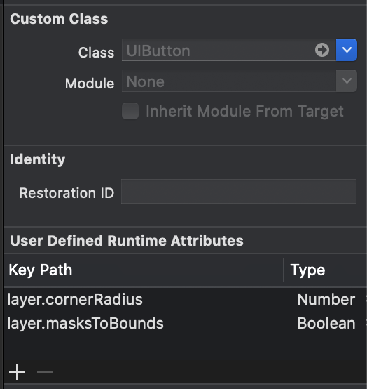

경기도 지역 화폐 가맹점 지도
===================

>이 프로젝트는 재난 지원금 으로 인해 지역화폐가 이슈가 되어서 지역화폐 찾는 지도 하나쯤 있으면 좋겠다 싶어서 만듬

</br>

이번 글에서는 경기도 지역화폐 가맹점 지도 앱을 만들것이다. 지도의 중심을 기준으로 주변의 가맹점들이 검색되어 지도에 핀으로 찍히고, 상호명으로 검색이되는 앱을 만들 생각이다. 이런 앱을 만드는 과정 속에서 습득했고 또 알고있던 기본개념들을 정리해보았으며, 기술적으로 레벨업시키기 위해 노력했던 과정을 공유해보고자 한다. 

프로젝트에 대해서 궁금한 점이 있거나 부족한 점이 보인다면 이슈 탭에 코멘트 언제든지 환영. 

</br>

목차
-----
[1. 준비](#준비)  

+ 프로젝트 추상화

  + 주요 객체
  + 상호작용

+ 프로젝트 구체화


[2. Coding](#Coding)

+ Model

  + Codable

+ View

  + 커스텀 뷰 만들기
  + User Define Attribute

+ View Controller

  + Alamofire로 서버와 통신하기


[3.문제 해결](#문제-해결)

+ 비동기적인 두개의 Stream을 동기적으로 처리하는 법

+ 캐싱으로 불필요한 호출을 줄여서 통신 시간 감축

  

[4. 프로젝트 리펙토링](#프로젝트-리펙토링) 

+ 비동기 처리를 RxSwift로. (<-- 리팩토링중)
+ <s>MVC를 MVVM으로.</s>

</br>
</br>

준비
-----
_개발환경_
> + Platform: iOS 
> + Language: Swift 5
> + Library: Alamofire  + RX Swift (리팩토링중) + <s>Realm (예정)</s>   

</br>

나는 객체 지향 방법론으로 이 프로젝트에 접근하여 개발하기 시작했다. 때문에 객체 지향에 대한 나 나름대로의 설명과 함께 이 프로젝트에 대한 기록을 설명할것.

객체 지향 방법론이란 프로젝트를 접근하는 방법 중 하나인데,  하고자 하는 프로젝트에서  대상화 할 수 있는 개념들을 위주로 생각하는 방법을 말한다. 즉, 어떤 대상들을 만들어서 이를 어떻게 엮어서 개발할것인가하는 방법이다. 또 이 방법론 중에서도 MVC디자인 패턴을 사용하였다.  

개발 파트에서는 이러한 접근법에 따른 얘기들과 또 실제 어떻게 개발했는지, 실제 개발하면서 어떤 어려움을 겪었으며 프로젝트를 업그래이드 시키기 위해서 어떤 노력을 했는지를 써보려고한다.

</br>

### 1.1. 프로젝트 추상화

프로젝트 추상화는 내가 만들 이 프로젝트를 머리속으로 시뮬레이션을 하면서 어떤 구성요소들로 이루어지는지 생각해보는 단계다.  

나는 프로젝트에 처음 접근 할 때 가장 중요한 구성요소들을 생각하여 이 프로젝트를 추상화 한다.
추상화 할 때 나는 내가 만들고자 하는 앱을 상상속에서 사용한다고 혹은 그 상황을 겪는 다고 상상하면서 그 상황이 성립하기 위해 핵심적인 필요한 요소들과 그 상황속에서 요소들이 사용되면서 일어나는 상호작용을 생각한다. 

생각을 잘못하면 이 프로젝트의 방향을 아주 잘못 잡아버리는 것이기 때문에 아주..! 신중하게 생각해야한다. (하지만 어렵다.. 잘못잡아서 개고생한적도 여러번.. 고로 신중히 또 신중히 하자.)

그럼 이제 신중하게 이 프로젝트에 필요한 중요 구성 요소들을 고민해보고 이들을 어떤 상호작용이 일어나는지를 고민해보자. 

</br>

### 1.1.1. 주요 객체

우리가 지도를 이용해 지역화폐 가맹점들을 찾는 상황을 생각해보자.
우리가 전지적 작가 시점에서 앱을 사용하는 상황을 본다고 생각 했을 때 어떤 것이 보일까?  
.  
.  
.  
.  
.  
지도 그리고 지도를 찾는 나 마지막으로 가맹점 즉 가게가 보일 것이다.

그럼 우리가 이 프로젝트를 만들기 위해서 만들 구성 요소는 크게 사용자, 지도, 가게일 것이다. (이 프로젝트에서 개인 별로 특화 되어 제공되는 데이터는 없기 때문에, 예를 들어 즐겨찾기 같은, 사용자객체는 매우 작을것.) 우리는 이런 개념지을 수 있는 구성요소들을 객체라고 한다. 이렇게 고민해서 만들어지는 프로젝트에 필요한  객체들을 Model이라고 한다.

그럼 우리는 이제 이 세개의 객체를 만드는데 우리가 원하는 행동을 위해 각각의 객체가 서로 상호작용하도록 만들면 개발 끝이다! 
개발 참 쉽다. (거짓)

```
* 중요한 3가지 객체 *
1. 지도
2. 가게
3. 사용자
```

</br>

### 1.1.2. 상호작용

그럼 이제 내가만들고자 하는 프로젝트에서 모델끼리 어떤 상호작용을 할지 하나하나 차근 차근 상상해보자. 

1. 지도-가게

```
1. 지도 위에는 가맹점인 가게 위치가 보여져야한다.
2. 지도 위의 가게를 클릭하면 가게에 대한 정보가 보여져야한다. 
```

지도-가게 상호작용을 본다면 지도 객체는 가게의 위치와 세세한 정보를 가지고 있는 객체가 필요해 보인다.
이말인 즉슨 가게 객체는 각각 가게의 위치와 세세한 정보를 포함하고 있어야한다는 얘기. 
나는 가게 객체로 부터 가게 정보를 받아와서 이 지도에 보여주면 된다. 

</br>

2. 지도-사용자
```
1. 사용자위치를 중심으로 지도를 보여준다.
```
지도-사용자의 상호 작용을 본다면 지도는 사용자의 위치를 중심으로 줌 레벨에 따라 지도의 일부분이 보여져야한다. 그런데 지도와 사용자만으로는 지도의 일부분이 보여진다는 것을 설명하기엔 좀 어색하다. 사용자 객체의 의의 사용자에 대한 정보를 담는 것인데 위치 정보는 그렇다 쳐도 줌 레벨은 뭔가 사용자가 가지기에는 어색한 정보라는 느낌이 있다.  이럴때는 새로운 객체가 필요하다는 뜻이거나 중요 객체를 잘못잡았다는 뜻이다.

여기서는 카메라라는 객체를 추가함으로써 지도의 일부분을 보여주는 상호작용을 할 수 있다. 카메라는 줌, 위치정보를 가지고 지도의 일부분을 보여준다. 카메라는 사용자로 부터 현재 위치를 받아와서 줌 레벨에 따라서 범위를 보여주게 된다.    

카메라의 위치정보는 사용자로부터 받아오면 된다.

</br>

3. 사용자-가게
```
1. 딱히 없다. 각각의 사용자가 모든 가게에 대해 동일한 정보를 받기 때문.  
만약 각각 다른 정보를 받아야한다면 다른 상호작용이 더 필요하겠지.
```

이제 이렇게 정해진 모델들과 모델들을 끼리의 상호작용을 사용자가 사용할 수 있게 만들면 정말 개발 끝이다!

</br>

### 1.2. 프로젝트 구체화

 머리속으로만 상상했던 정보표현이나 행동들을 우리는 실제 디바이스에서 사용자가 사용하도록 만들어야한다.

 나만의 자동차를 만든다고 상상해보자. 그런데 껍데기는 정해져있고 그 껍데기를 바탕으로 나만의  자동차를 만들어야한다. 상상을 마치고 나면 우리는 깝떼기를 디자인 할것이다. 어디는 어떤 색이고 여기는 이렇게 모양을 바꾸고. 또 엔진은 이런걸 쓰고 어떤 부품은 이런걸 쓰고... 이런 상황에서는 브레이크가 이렇게 잡히고.. 우리가 상상했던 정보를 토대로 차를 만들것이다. 

 앱도 똑같다. 우리는  iOS앱을 통해서 우리가 상상하는 것을 만들것이다.  껍데기를 뷰라고 한다. 이 뷰를 통해 우리는 앱의 시각적인 정보를 얻고 터치를 하면서 사용하게 된다. 그럼 이제 우리는 뷰를 만들고 우리가 원하는 앱을 만들기 위해 우리가 머리속으로 상상한 모델들을 표현하기 위해 뷰를 디자인하고 또 사용자가 사용할 때 취할 행동들을 정하면 된다. 앱에서 이런것들은 데이터를 통해서 정해지는데 이런 정보들을 모델이 가지고 있게 만든다. 그리고 이러한 일련의 작업들을 위 상상에서 자동차를 만들 때는 내가 직접 자동차에 필요한 정보들을 구상하고 또 만들었지만 앱에서는 직접할수는 없으니  컨트롤러라는 것이 이러한 작업을 수행하게 하는 것이다.

 이렇게 만들어지다보니 뷰는 단순히 보여지는 껍데기라 껍데기만 똑같다면 다른데서도 사용할 수 있고, 모델도 데이터만 가지고 있는 친구다 보니 필요한 곳에서라면 어디서든 사용할 수 있는 장점도 생긴다.

개발전에 생각할 것이 이렇게 많다.. 그럼 이제 드디어 실제로 경기도 지역화폐 가맹점 지도를 위한 껍데기 뷰, 모델, 컨트롤러를 만들어보자. 

</br>

</br>

코딩
----

 자 이제 진짜로 만들어보는 단계다.

여기서 부터는 코딩하면서 처음 알게되거나 자주 찾아보는 것들 위주로 설명하려한다.

 </br>

 ### 2.1. Model

### Codable
Codable은 JSON같은 외부표현으로 만들어진 Data 그 자체를 Swift에서 객체로 사용하기 위한 데이터를 변환하는 프로토콜이다. 외부표현을 Swift객체로 바꿀 뿐만 아니라 Swift객체를 외부표현으로 바꿔주기도 하면서 Encode & Decode의 방법을 가지고있다. 실제로 Swift의 Decodable과 Encodable프로토콜을 합쳐서 만든것이다.

그럼 간단한 Struct를 만들어보면서 알아보자. 간단한 Person 구조에 Codable을 채택해보자. 

```
struct Person: Codable {
	var age: Int
	var name: String
}
```

이렇게 만든 Swift의 Struct를 외부 네트워크에 JSON형식으로 보내고싶다. 그러면  JSON.age = Person.age 같은 방식으로 일일히 넣어줄수도 있지만.

귀찮다... 그리고 인스턴스화 된 Person 객체의 데이터 변화에 대응하기도 어렵고, 무엇보다 변수가 많아진다면? 귀찮아진다. 때문에 우리는 Codable로 우하하게 JSON으로 encode하고자 하는것이다. 다음과 같은 방식으로 JSON으로 encode할 수 있다.

```
let encoder = JSONEncoder()
let person = Person(age: 28, name: "pil")
let jsonPersonData = try? encoder.encode(person)
```

jsonPersonData의 내부를 들여다 보면 다음과 같다.

```
{
	"name": "Zedd",
	"age": 100
}
```

그럼 이제 위의 JSON데이터를 Swift객체로 디코딩 해보자. 인코딩했을 때 처럼 디코더를 만들어주고 디코딩을 해주면 된다.

```
let decode = JSONDecoder()
var data = jsonPersonData.data(using: .utf8)
let person = try? decoder.decode(Person.self, from: data)
```

끝.

</br>
</br>

### 2.2. View

### User Define Runtime Attribute

이게 뭐냐면 커스텀 뷰를 위한 클래스를 따로 만들지 않고 스토리보드 내에서 간단한 특징을 컨트롤하여 커스텀 뷰를 만드는 탭이다. 



다음과 같이 뷰 변경 함수에 사용하듯이 키에 값을 삽입해 주면 된다. 그런데 주의할 점은 User Define Runtime Attribute탭에서 지원하는 Type을 받는 키만 사용할 수 있다는 것이다. 예를 들어 쉐도우 코드를 보면 UIColor나 Float값들을 받는 키들은 사용이 가능하다. 하지만 Size를 받는 타입은 없는데 이렇게 되면 사용할 수 없다. (그런데 사이즈는 그냥  CGSize.width이런식으로 키값에 접근하면 되지만 어쨌든..)

</br>
</br>

### 2.3. Controller

</br>

### Alamofire로 서버와 통신하기

우리는 지도 중심의 위치를 URL로 위도와 경도를 네이버 서버에 전송하고 그에 맞는 주소지를 받아올것이다. URL로 서버에 데이터를 전송하고 데이터를 받아온다는 사실이 익숙하지 않을 수 있다. 

이를 알기 위해서 우리가 사용하는 URL을 생각해보자. URL로만 네이버 카페에 들어간다고 했을때 www.naver.com/cafe 라고 쳐볼 수 있을 것이다. (실제 들어가지는지는 모르겠다. 중요하지도않다.). 
우리가 쳐본 URL을 뜯어보자. www.naver.com은 우리가 접속하고자 하는 서버의 도메인이다. 중요한것은 슬래시 부터인데 .com하고 /cafe라고 되어있는 것을 볼 수 있다.  
이게 무슨 뜻인지 그 과정을 뜯어보자. www.naver.com 서버의 cafe경로에 들어간다는 뜻이다. 좀더 자세히 생각해 보면 우리는 서버에 나 /cafe에 들어갈거니까 여기에 필요한 데이터와 알맞는 페이지를 보여줘. 라는 뜻이 되겠다. 중요한 대목은 나 카페라는 경로에 들어갈거야 하는 데이터를 전송한다는 것과 필요한 데이터를 내놔 라는 말이다. 이말을 보면 URL로 데이터를 명령을 보내고 그 결과를 받을 수 있다는 말이되겠다.   

여기서 데이터를 보내고 받을때 인간의 언어처럼 서버가 알아들을 수 있는 규칙이 있을텐데, SOAP, DCOM, DEC, REST.. 등등 많지만 공공 데이터 포털에서는 REST방식을 지원한다.
REST는  쉽게  URL을 통해 필요한 자원을 표현한다는 특징이 있다. www.naver.com/cafe처럼 우리가 필요로 하는 자원을 URL로 표현한다.

그럼 이제 실제 어떤식으로 호출하는지 알아보자. 호출은 다음과 같이 일어난다.

```

	Application +--> Send url +--> get data +--> use data

```

그럼 여기서 우리는 url을 보내는 법과 데이터를 받아와서 사용할 수 있는 방법을 배우면된다. 이러한 일련의 과정을 쉽게 할 수 있도록 도와주는 것이 Alamofire이다.

</br>

Alamofire를 사용하는 틀은 기본적으로 다음과 같다.

```
AF.request(url)
	.validate()
	.responseDecodable(of: DecodableObject.self)
```

+ __.request(url):__  
   url을 통해서 서버에 자원을 호출한다. 이 때 주의할 점은 url에 대한 정해진 규칙이 있을텐데 이를 준수하면서 호출해야 한다는 것

+ __.validate():__  
   dot(.)으로 이어지는 함수의 chaining은 이전 dot에 대한 함수의 반환값에 대해 실행한다고 생각하면된다. 그럼 request한 값이 유효한 값인가? 검사해주는 단계이다.

+ __.responseDecodable(of: decodableObject.self):__  
  유효성이 확인이 되었다면 이제 받은 데이터를 이 함수에서 사용하게 된다. alamofire는 데이터 타입에 따라서 서버로부터 자원을 받아온다. 그런데 swift는 Object자체를 JSON같은 dataType으로 만들수 있어서 객체 자체에 response를 받아와서 사용한다. 이런 dataType으로 사용 가능한 객체를 swift에서는 Codable한 객체라고 한다. 여기서는 decodableObject가 Codable한 객체인데 decodableObject에 따라 데이터를 받아와서 사용하는 부분이 되겠다.

  resposneDecodable말고도 responseJSON, responseString같이 이미 decode될 데이터가 정해져 있는 함수도 있기 때문에 필요에 따라 쓰면된다.

</br>
</br>


발생한-문제와-해결
----------------------

__3.1. 비동기 처리: 비동기 프로세스 동기적으로 처리하기__

현재 위치를 가져오고 그 위치를 기반으로 주변의 가맹점 정보를 불러오는 상황이였다.
네트워킹 작업 하나가 끝나고 난 후 받아온 정보를 가지고 또 다른 네트워킹 작업을 해야하는 상황.
도식화 시켜보면 이러하다.
```
[가맹점 정보 GET 프로세스]

  지도 이동 +--> 이동위치 좌표기준 주소 불러오기 +--> 성공: 주소기준 지역화폐 가맹점 정보 
                   (Reverse Geocoding)     |     불러오기 (Fetching Stores)
                                           |
                                           +--> 실패: ㅠㅠ

```
그냥 순서대로 호출해서 사용하면되지! 하고 했지만 그러지않았다.
__Alamofire의 네트워킹 작업은 전부 비동기 작업이기 때문에 Reverse Geocoding이 끝나기 전에  Fetching Stores가 호출되는 문제가 일어났다.__  때문에 이런 비동기작업을 동기적으로 (다발성으로 일어나는 작업을 순서대로!) 처리해줘야한다. 그러기 위해서는 몇가지 스킬이 있는데 __escaping closure__를 사용해서 처리해보자.

__Escaping Closure (@escaping)__

이스케이핑 클로저란 함수가 전부 반환이 되고 난 뒤에 실행되는 함수를 변수로 받아와 사용하는 것을 의미합니다.
다음과 같이 선언되어서 사용할 수 있습니다. completionHandler같은 함수를 받아와 함수가 끝나는 시점에 호출해주면서 사용하게 됩니다.

```
func reverseGeocoding(lat: Double, lng: Double, completionHandler: @escaping (Bool, Address?, String?) -> Void) 
```

이렇게 하면 실제 사용할 때 fetch stores를 콜백함수로 받아와서 사용해주면됩니다.

```
reverseGeocoding(lat: 0.0, lng: 0.0) { bool, addr, str in
	fetchStores()
	// 생략..
}
```

그럼 만약 순서대로 진행되어야만 하는 비동기 작업들이 많아지고 길어진다면? 콜백의 콜백을 하게 될것이다.
이렇게 되면 코드만 보고 무슨뜻인지 아는데 오래걸리게 될 것이고, 지저분 해져서 가독성도 떨어질 것이다.
이것을 콜백 지옥이라고 하는데 이런 문제를 해결하기 위해서 RxSwift같은것을 사용하는 것인가보다. 
그래서 뒤에서는 더 나아가 RxSwift로 이 프로젝트를 더 가독성있고 시퀀셜하게 짜보려고한다. 

</br>


__3.2. Concurrent Queue, 캐시 : 지도가 움직일때마다 발생하는 데이터가 호출 처리하고 줄이기__

이 앱은 지도의 카메라를 움직일 때 마다 그 지역의 가맹점 정보를 API로 부터 불러 들이는 구조를 가진다.
그런데 만약 사용자가 먼 지역으로 카메라를 이동한다면? 또, 카메라를 많이 움직이는 작업을 한다면? 그러면 API 호출 횟수가 N의 크기로 증가할 것이다.

측정 결과 reverseGeocoding하는데 0.3초, fetStores하는데 0.7초 총 약 1초가 한번의 카메라 움직임에 소요된다. 그렇게되면 움직일 때마다 사용자는 1초씩 기다려야 지도를 움직이거나 다른 작업을 할 수 있다는 얘기가 되는데, 이는 사용하는데 있어서 엄청난 걸림돌일 것이다.

</br>

__Concurrent Queue__

이 문제를 해결하기 위해서는 먼저 들어온 요청이 끝나고 나서 다음 요청을API에 전달하는 방식이 아니라, 요청은 들어오는대로 API에 보내고 먼저 끝난 순서대로 받아와서 지도에 데이터를 보내주는 프로세스가 필요할 것이다. 이렇게 되면  적어도 사용자가 지도를 움직이는데 있어서 기다리지 않아도된다.

이러한 방식을 비동기 처리, 그중에서도 Concurrent Queue를 이용한 비동기 처리가 되겠다. Concurrent Queue를 이용한 비동기 처리는 다음과 같이 사용한다.

```
let queue = DispatchQueue(label: "concurrentQueue", attributes: .concurrent)

queue.async {
	for i in 0..<5 {
		print(i)
	}
}

queue.async {
	for i in 10..<20 {
		print(i)
	}
}
```

이 구문의 결과는 concurrent queue에서 일어나는 비동기 작업이기 때문에 정확하지는 않지만 다음과같이 동시에 진행된 결과가 나올 것이다.

```
0
10
1
11
2
12
3
13
.
.
.
```

</br>

</br>

__캐시 (NSCache)__

이런식으로 동시에 들어오는 요청들을 처리하고 지도에 데이터를 넣어준다 해도 요청 자체가 무수하게 발생하기 때문에 근본적인 문제를 해결할 수 는 없을 것이다. 이런 상황은 성능 문제를 틀림없이 야기할 수도 있다. 

때문에 절대적인 요청 갯수를 줄이는 방법을 찾아야한다. 그 방법의 하나로 이미 방문한 지역의 데이터는 또 불러오지 않는 방법을 생각했다. 그러면 방문한 지역의 데이터를 저장할 곳이 필요한것이 되는데, 앱데이터에 저장해놓고 사용하면 앱자체의 크기가 커져 네트워킹으로 가맹점 정보를 불러오는 의미가 퇴색 될것이고, 변수 자체에 저장해서 쓰다보면 앱의 메모리가 커지기 때문에 성능에 지장이 생길거라고 생각했다. 또, 메모리 해제를 정확하게 하지 못하면 메모리 낭비까지 생기기 쉬운 구조라고 생각했다. 이 모~든 것을 해결해줄 수 있는 것이 바로 __캐시__다.

캐시란? 보통 캐시 메모리를 줄여서 그냥 캐시라고 하는데 사전적인 의미는 주기억 장치와 CPU사이에 개념적으로 위치하며 자주사용하는 프로그램과 데이터를 잠시 기억했다 필요없으면 지워버리는곳이다.  이 말인 즉슨 쉽게 얘기하면 캐시는 필요한 데이터는 저장해뒀다가 필요없어졌을때 지워버릴 수 있는 메모리다. 물론 물리적으로는 앱내에 메모리로써 캐시 메모리가 차지되겠지만 단순히 앱을 사용할 때 뿐이고 앱을 사용하지 않을 때는 비워버리도록 하면서 메모리에 대한 타협을 하면서 전략적으로 사용할 수 있는 개념이다.

 iOS에서는 친절하게도 NSCache라는 객체로 이 캐시를 쉽게 구현할 수 있도록 해준다. NSCache는 다음과같이 자료형을 명시해주는 식으로 정해진 타입을 저장할 수 있는 캐시메모리를 선언할 수 있다.

```
let cache: NSCache<NSString, UIImage> = NSCache()
```

그러면 이제 이를 사용하는 방법을 알아보자.

```
cache.countLimit = 허용하는 Key의 최대 개수.
cache.totalCostLimit = cost합계의 최대 값.
```

우선 캐쉬의 프로퍼티를 정해준다. 위에서부터 순서대로 countLimit은 허용하는 Key의 최대 개수이고 totalCostLimit은 cost합계의 최대값인데 이게 무슨 뜻이냐면 캐쉬에 저장되는 것들에 값을 메기고 이들의 합이 기준을 넘었을 때 NSCache는 데이터를 버리도록 설계되어있는데, 이때의 기준이 totalCostLimit이다. 

그럼이제 이 캐시에 데이터를 넣고 사용하는 방법을 알면 된다.

데이터를 넣는 방법은 이러합니다.

```
cache.setObject(obj: storedObject, forKey: objectKey, cost: objectCost)
```

 key와 cost와 함께 object를 저장한다. 키를 통해 저장된 데이터를 구분하고 cost를 통해 캐시내의 데이터 순서를 정합니다.
순서가 중요한데 NSCache는 FIFO의 특징을 가지고 있어 앞에있는 데이터 먼저 지워지게 되는데, cost가 낮을수록 앞에 위치하게 됩니다.   

데이터를 사용하는 방법은 이러합니다.

```
let object = cache.object(forKey: key)
```

단순히 다음과 같이 키로 불러와서 저장된 객체의 타입에 따라 사용하면 됩니다.

</br>
</br>

프로젝트-레벨업
-----------------

__4.1. RX Swift 적용하기__

리팩토링중...


